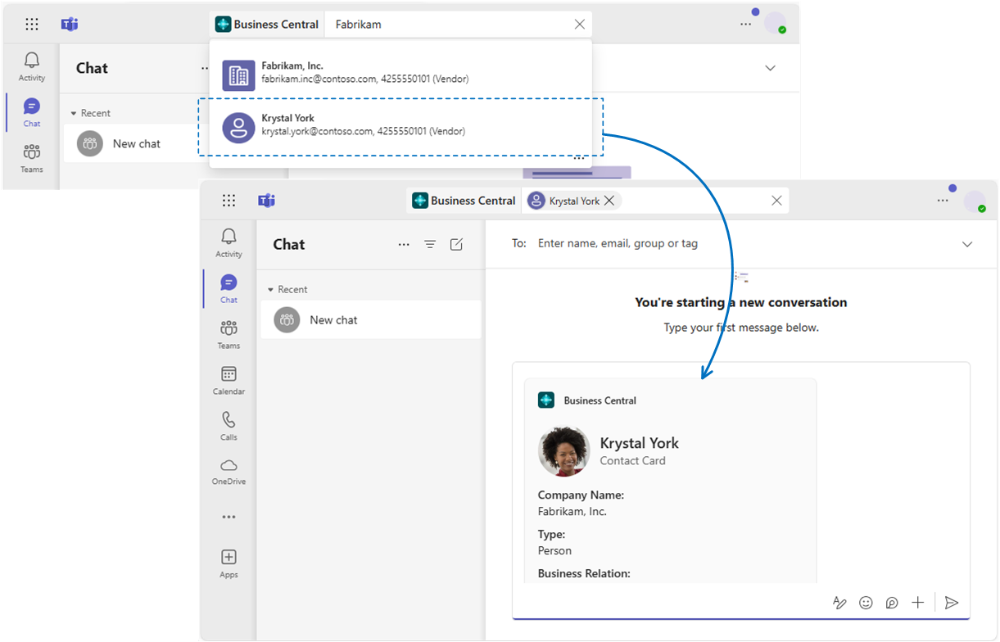
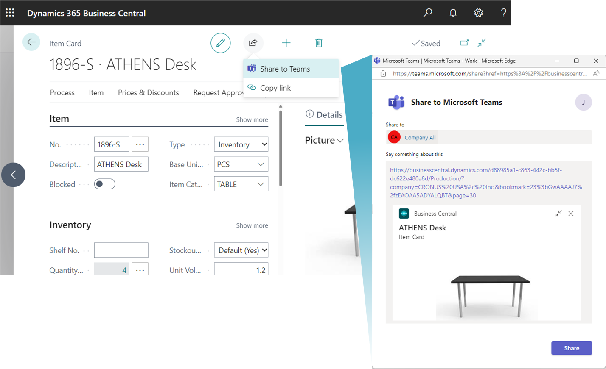
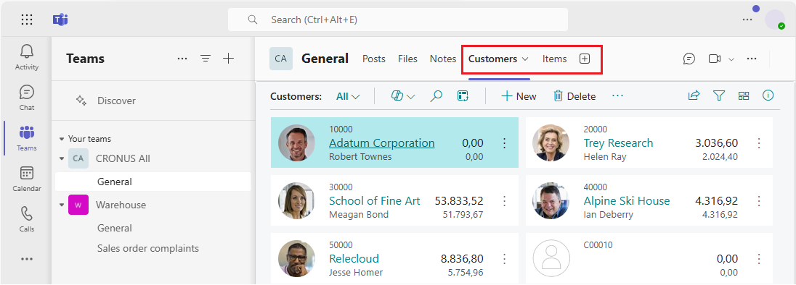

# Business Central and Microsoft Teams Integration

[!INCLUDE [online_only](includes/online_only.md)]

[Microsoft Teams](https://www.microsoft.com/en-us/microsoft-365/microsoft-teams) is a Microsoft 365 product that lets you connect with others, collaborate seamlessly, and simplify work. [!INCLUDE [prod_short](includes/prod_short.md)] offers an app that connects Microsoft Teams to your business data in [!INCLUDE [prod_short](includes/prod_short.md)] so you can quickly share details across team members, look up contacts, and respond faster to inquiries.

The app is available on the Teams marketplace, and you can use it with the Teams desktop, mobile app, or web.

## Features overview

The [!INCLUDE [prod_short](includes/prod_short.md)] app for Teams offers the following features.

### Look up details of customers, vendors, and other contacts

No matter where you are in Teams, you can look up details about customers, vendors, and other [!INCLUDE [prod_short](includes/prod_short.md)] contacts. This feature not only lets you view general information about contacts, but also gives access to interaction history, related documents, and more.

You can also share contact details in a conversation. From there, participants have access to even more details about the contact as well.

Learn more in [Searching for Contacts from Microsoft Teams](across-search-contacts-teams.md).

### Share records in conversations

Copy a link to any Business Central record and paste it into a Teams conversation to share with your coworkers. The app will then expand the link into a compact, interactive card that displays information about the record.

Once in the conversation, you and coworkers can view more details about the record, edit data, and take action - without leaving Teams.

Learn more in [Share Records in Microsoft Teams](across-working-with-teams.md).

### Share links from pages in Business Central to Teams

Directly from most collection and details pages in Business Central, you can use the **Share to Teams** action from the  icon to type a message, choose recipients, such as team members, groups or channels, and send the message with a link and to the Business Central page.

<!---->

Learn more in [Share Records and Page Links in Microsoft Teams](across-working-with-teams.md#share-link).

### Add a Business Central tab to Teams channel or chat

With the Business Central app for Teams installed, you can add a tab in a channel or chat the shows Business Central data from lists and card pages.

Learn more in [Add a Business Central tab in Teams](across-teams-tab.md).

## Get Started

1. A [!INCLUDE [prod_short](includes/prod_short.md)] online user account is required for [!INCLUDE [prod_short](includes/prod_short.md)] app for Teams.

   If you’re not sure whether you have an account, or if you don’t know your credentials for signing in, contact your company administrator to help you get started.

   > [!TIP]
   > If your organization doesn't have a [!INCLUDE [prod_short](includes/prod_short.md)] subscription, you can sign up for a free trial. Learn more at [Sign up for a free Dynamics 365 Business Central trial](trial-signup.md).

2. As an administrator, refer to [Managing Microsoft Teams Integration with Business Central](admin-teams-integration.md) for information about getting users set up to work with [!INCLUDE [prod_short](includes/prod_short.md)] and Teams.
3. Install [!INCLUDE [prod_short](includes/prod_short.md)] app in Teams. See [Install the [!INCLUDE [prod_short](includes/prod_short.md)] App for Microsoft Teams](across-install-app-for-teams.md).
4. Once the app is installed, you're ready to go. Learn more in [Searching for Customers, Vendors, and Other Contacts from Microsoft Teams](across-search-contacts-teams.md) and [Share Records in Microsoft Teams](across-working-with-teams.md).

## Related information

[Teams FAQ](teams-faq.md)  
[Troubleshoot Teams](admin-teams-troubleshooting.md)  
[Change Company and Other Settings in Teams](across-teams-settings.md)  
[Develop for Teams Integration](/dynamics365/business-central/dev-itpro/developer/devenv-develop-for-teams)  
  
## [!INCLUDE[prod_short](includes/free_trial_md.md)]  

[!INCLUDE[footer-include](includes/footer-banner.md)]
