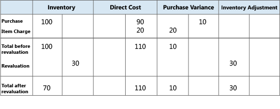

# Design details: variance

Variance is the difference between the actual cost and the standard cost, as described in the following formula:  

- actual cost – standard cost = variance  

If the actual cost changes, for example, because you post an item charge on a later date, the variance updates accordingly.  

> [!NOTE]  
> Revaluation doesn't affect the variance calculation because revaluation only changes the inventory value.  

## Example  

The following example illustrates how [!INCLUDE [prod_short](includes/prod_short.md)] calculates variance for purchased items based on the following scenario:  

1. You purchase an item for 90.00 in local currency (LCY), but the standard cost is LCY 100.00. Accordingly, the purchase variance is LCY –10.00.  
2. The purchase variance account is credited with LCY 10.00.  
3. You post an item charge of LCY 20.00. Accordingly, the actual cost increases to LCY 110.00, and the value of the purchase variance becomes LCY 10.00.  
4. The purchase variance account is debited with LCY 20.00. Accordingly, the net purchase variance becomes LCY 10.00.  
5. You revalue the item from LCY 100.00 to LCY 70.00. This doesn't affect the variance calculation, only the inventory value.  

The following table shows the resulting value entries.  

  

## Determining the standard cost  

The standard cost is used when calculating variance and the amount to capitalize. Because the standard cost can change over time due to manual update calculation, you need a point in time when the standard cost is fixed for variance calculation. This point is when you invoice the inventory increase. For produced or assembled items, the point when standard cost is determined is when the cost is adjusted.  

 The following table shows how different cost shares are calculated for produced and assembled items when you use the Calculate Standard Cost action.  

|Cost share|Purchased item|Produced/Assembled item|  
|----------------|--------------------|------------------------------|  
|**Standard Cost**||Single-Level Material Cost + Single-Level Material Non-Inventory Cost + Single-Level Capacity Cost + Single-Level Subcontrd. Cost + Single-Level Cap. Ovhd. Cost + Single-Level Mfg. Ovhd. Cost Go to the **Manufacturing Setup** page and turn on the **Include Non-Inventory Items to Produced Items** toggle to include Single-Level Material Non-Inventory Cost into produced items. Single-Level Material Non-Inventory Cost cannot be included into cost of assembled items.|  
|**Single-Level Material Cost**|Unit Cost|Sum of standard or unit costs of components and subassemblies    Only items of type Inventory|  
|**Single-Level Material Non-Inventory Cost**|Not applicable|Sum of unit costs of components     Only items of type Non-Inventory|
|**Single-Level Capacity Cost**|Not applicable||  
|**Single-Level Subcontrd. Cost**|Not applicable||  
|**Single-Level Cap. Ovhd Cost**|Not applicable||  
|**Single-Level Mfg. Ovhd Cost**|Not applicable|(Single-Level Material Cost + Single-Level Material Non-Inventory Cost + Single-Level Capacity Cost + Single-Level Subcontrd. Cost + Single-Level Cap. Ovhd Cost) * Indirect Cost % / 100 + Overhead Rate|
|**Rolled-up Material Cost**|Unit Cost||  
|**Rolled-up Material Non-Inventory Cost**|Not applicable|Sum of Rolled-up Material Non-Inventory Cost + Single-Level Material Non-Inventory Cost|
|**Rolled-up Capacity Cost**|Not applicable||  
|**Rolled-Up Subcontracted Cost**|Not applicable||  
|**Rolled-up Capacity Ovhd. Cost**|Not applicable||  
|**Rolled-up Mfg. Ovhd. Cost**|Not applicable||  

## Related information  
 [Design Details: Inventory Costing](design-details-inventory-costing.md)   
 [Design Details: Costing Methods](design-details-costing-methods.md)
 [Managing Inventory Costs](finance-manage-inventory-costs.md)  
 [Finance](finance.md)  
 [Work with [!INCLUDE[prod_short](includes/prod_short.md)]](ui-work-product.md)

[!INCLUDE[footer-include](includes/footer-banner.md)]
