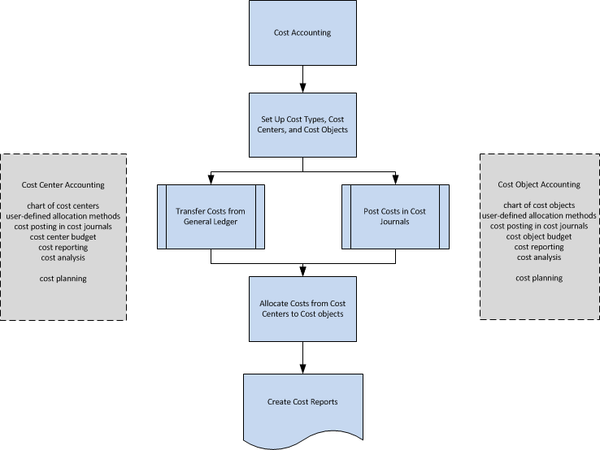

# About cost accounting

Cost accounting can help you understand the costs of running a business. Cost accounting information is designed to analyze:  

- What types of costs your business incurs.  
- Where the costs occur.
- Who bears the costs.

In cost accounting, you allocate actual and budgeted costs of operations, departments, products, and projects to analyze the profitability of your company.  

## Workflow in cost accounting

Cost accounting has the following main components:  

- Cost types, cost centers, and cost objects  
- Cost entries and cost journals  
- Cost allocations  
- Cost budgets
- Cost reporting  

The following diagram shows the workflow in cost accounting.  

  

## Cost types, cost centers, and cost objects

You define cost types, cost centers, and cost objects to analyze what the costs are, where the costs come from, and who should bear the costs.  

First, you define a chart of cost types with a structure and functionality that resembles the general ledger chart of accounts. You can create your own chart of cost types or do so by transferring the general ledger income statement accounts.  

Cost centers are departments and profit centers responsible for costs and income. Often, there are more cost centers set up in cost accounting than in any dimension that is set up in the general ledger. In the general ledger, typically only the first level cost centers for direct costs and the initial costs are used. In cost accounting, more cost centers are created for extra allocation levels.  

Cost objects are products, product groups, or services a company offers. These objects are the "finished goods" that carry the costs.  

You can link cost centers to departments and cost objects to projects in your company. Through the general ledger, you can link cost centers and cost objects to any dimensions and supplement that information with subtotals and titles.  

## Cost entries and cost journals

Operational costs can be transferred from the general ledger. You can automatically transfer the cost entries from the general ledger to cost entries with each posting. You can also use a batch job to transfer general ledger entries to cost entries based on daily or monthly summary posting.  

In cost journals, you can post cost and activities that don't come from the general ledger or aren't generated by allocations. For example, you can post pure operational costs, internal charges, allocations, and corrective entries between cost types, cost centers, and cost objects individually, or on a recurring basis.  

## Cost allocations

Allocations move costs and revenues between cost types, cost centers, and cost objects. Overhead costs are first posted to cost centers and later charged to cost objects. An example would be a sales department that sells several products at the same time. The department's overhead costs, such as salaries, supplies, and travel expenses, are initially assigned to the sales cost center. The costs are then allocated between the different products (cost objects) sold, together with the materials purchased (direct cost).

The allocation base and the accuracy of the allocation definition influence the results of cost allocations. The allocation definition allocates costs first from so-called precost centers to main cost centers, and then from cost centers to cost objects.  

Each allocation consists of an allocation source and one or more allocation targets. You can allocate actual values or budgeted values using the static allocation method based on a definite value. For example, square footage, or an established allocation ratio of 5:2:4. You can also allocate actual values or budgeted values by using the dynamic allocation method with nine predefined allocation bases and 12 dynamic date ranges.  

## Cost budgets

Similar to budgeting in the general ledger, you can create budgets to plan for costs during a certain period (a fiscal year, for example), which can be applied to a cost center (company department), or a cost object (product or service). You can create as many cost budgets as you need. You can then copy the cost budget to the general ledger budget and vice versa. And you can transfer budgeted costs as actual costs.

## Cost reporting

Most reports and statistics are based on the posted cost entries. You can set the sorting of the results and use filters to define which data must be displayed. You can create reports for cost distribution analysis. In addition, you can use the standard financial reports to define how your reports for the chart of cost types are displayed.  

[!INCLUDE [tip_open_report_from_docs](includes/tip-open-report-from-docs.md)]

[!INCLUDE [finance_reports_cost_accounting](includes/finance-reports-cost-accounting-include.md)]

## Related information

[Accounting for Costs](finance-manage-cost-accounting.md)  
[Cost accounting reports](finance-cost-accounting-reports.md)   
[Finance](finance.md)  
[Terminology in Cost Accounting](finance-terminology-in-cost-accounting.md)  
[Work with [!INCLUDE[prod_short](includes/prod_short.md)]](ui-work-product.md)

[!INCLUDE[footer-include](includes/footer-banner.md)]
