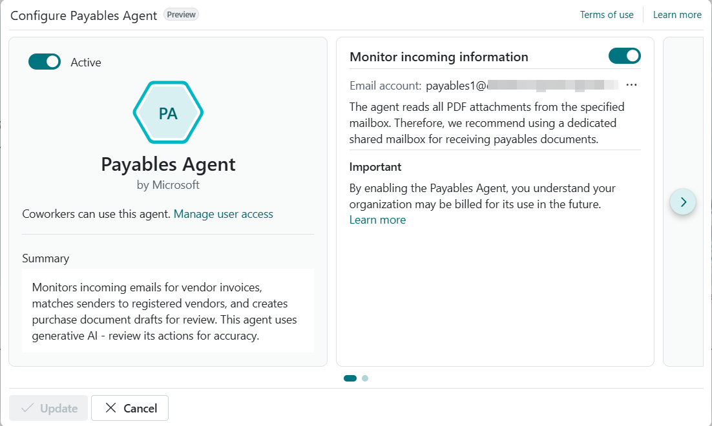
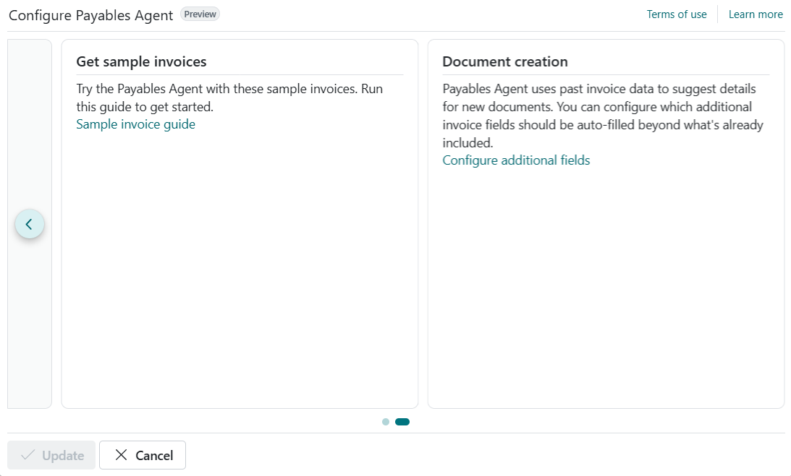

# Set up Payables Agent (preview)

[!INCLUDE [preview-banner](~/../shared-content/shared/preview-includes/preview-banner.md)]

The Payables Agent in Business Central automates processing of vendor invoices received from vendors through email as PDF documents. This article explains how to set up, activate, configure the Payables Agent, and manage user access.

Learn more about the agent in [Payables Agent overview](payables-agent.md).

[!INCLUDE [preview-note](~/../shared-content/shared/preview-includes/production-ready-preview-dynamics365.md)]

<!--[!INCLUDE [limited-public-preview](includes/limited-public-preview.md)]-->

## Prerequisites

Before configuring and activating the Payables Agent, ensure the following prerequisites are met:

- The Business Central environment is one of these country/region versions: AU (Australia), GB (Great Britain), NZ (New Zealand), or US (United States).

  Payables Agent is currently unavailable in other countries/region versions. Learn more about geographic and language availability at [Copilot international availability](https://aka.ms/bapcopilot-intl-report-external).
- Set up the email account for receiving vendor invoices PDF documents.

   The Payables Agent monitors incoming emails to this mailbox. The email account must be a **Microsoft 365** type (user mailbox or shared mailbox) in your organization. Learn more at [Set up email](admin-how-setup-email.md).

   > [!IMPORTANT]
   > To activate and configure the agent, you need **Read and manage (Full Access)** and **Send as** permission on the mailbox, unless it's your personal mailbox. As an Exchange admin, delegate these permissions to all users who need to activate and configure the agent. Learn more in [Use the Exchange admin center to edit shared mailbox delegation](/microsoft-365/admin/email/create-a-shared-mailbox#use-the-eac-to-edit-shared-mailbox-delegation).
   >
   > When a user activates the agent, it runs as a background task in the context of that user and needs access to the shared mailbox to process emails. It might take a few hours for Exchange to propagate the permissions to the selected users.
- Set up the Business Central environment for billing agent capabilities in the Business Central Admin Center.

   Agents use Microsoft Copilot Studio messages when activated, which your company is charged for. Learn more in [Manage consumption-based billing](/dynamics365/business-central/dev-itpro/administration/tenant-admin-center-manage-consumption-billing).

- Turn on the **Allow HttpClient Requests** toggle in the **Payables Agent** extension settings (sandbox environments only)

   Open the [Extension management](https://businesscentral.dynamics.com/?page=2500) page, select **Payables Agent**, and then turn on the **Allow HttpClient Requests** toggle.

## Turn on Payables Agent capability for environment

The agent capability is on if the  **Payables Agent** icon appears in the top navigation menu of the role center.

If the icon isn't present, turn it on from the **Copilot & agent capabilities** page, like other Copilot features in Business Central. The Payables Agent is listed under **Production ready previews**. Learn more in [Configure Copilot and AI agent capabilities](enable-ai.md).

Next, configure and activate the agent so it can process vendor invoices.

## Configure and activate Payables Agent

Configure and activate the Payables Agent for your company. Only one Payables Agent is allowed per company, but you can give access to many users.

1. In the navigation bar at the upper right of the role center, select  **Payables Agent** > **Activate**.

1. On the **Configure the Payables Agent** wizard, turn on the **Monitor incoming information** toggle, select the **Mailbox** check box, and then set **Mailbox** field to the email account you want the agent to monitor.

   

   The configuration of an agent can span multiple pages in the configuration. For the Payables Agent, two more configuration options are available on the next page. Use the navigation action on the right side of the wizard to progress to the next page of the wizard.

   

   1. **Get sample invoices**  

      This option shows in evaluation companies only and intends to provide easy access to demo invoices so you don't have to produce invoices yourself. These invoices work well with the Contoso Coffee demo data. The wizard lets you let the system send the sample invoices to the monitored mailbox, in which case they're sent from the same mailbox. The wizard also lets you the sample invoices so you can send them from your own mailbox to the monitored mailbox

      > [!TIP]
      > If you let the agent send the sample invoices, they show up in the agent task pane as coming from the same mailbox as is being monitored. Basically, it sends an email to itself with the prepared samples. 
   1. **Document Creation**  

      Select more fields from matched purchase invoice history to populate automatically when the agent finalizes purchase document drafts to become purchase invoice documents. This feature ensures that purchase invoice line fields that aren't visible in the purchase document draft can be populated in the same process when matched with historic data. It's the way the generic **Purchase document draft** experience supports fields from customizations and add-on apps.

1. Select **Manage user access** to specify more agent supervisors who can manage or interact with the agent. You can add more users now or later. Learn more in [Manage user access to the Payables Agent](#manage-agent-permissions-and-user-access).
1. Turn on the **Active** toggle.
1. Select **Update** to complete the setup.
1. Ensure the Payables Agent's language is set to a supported language.

   When you configure the agent, it uses the same language as the display language of your workspace. [Learn how to change the agent's language](#change-language-and-regional-settings).

The **Payables Agent** icon changes to , indicating the agent is active and ready to handle incoming vendor invoices sent to the mailbox.

> [!TIP]
> Refer to [Payables Agent process flow](payables-agent.md#payables-agent-process-flow) to understand the agent in more details and learn how it works.

> [!NOTE]
> The  icon indicates the agent is configured with a mailbox, but it's not active. To activate it, select the icon, then select  **Configure Payables Agent** to reopen the configuration page. From there, turn on the **Active** toggle.

## Manage agent permissions and user access

### Add agent users

As an administrator, you can specify which users have permission to use or configure the Payables Agent. There are two ways to add and configure agent users:

#### [From Configure Payables Agent page](#tab/payablesagentconfig)

1. Open the **Configure Payables Agent** page by selecting  **Payables Agent** >  **Configure**.
1. Turn off the **Active** toggle.
1. Select **Manage user access**.
1. On the **Select users that can manage or interact with the Agent** page, you can do the following steps:

   - To add a user, select an empty line, select the **User Name** field, then select the user from the list.
   - To give a user permission to configure Payables Agent, select the **Can configure** check box.    The **Can configure** setting defines whether a user has access to update the agent configuration (for example, updating the designated mailbox, activating and deactivating the agent, and other settings) or only to work with the agent tasks (for example, reviewing and confirming agent steps).
   - To remove a user's access to the agent, select  **Show more options** next to the user name, and then select **Delete**.

#### [From Payables Agent card page](#tab/payablesagentpage)

1. To open the **Payables Agent** card page, search (<kbd>Alt</kbd>+<kbd>Q</kbd>) for  **Agents**, and then select **PAYABLES AGENT - [COMPANY]**.
1. Set **Status** to **Disabled** to deactivate the agent.
1. In the **User access** section, do the following steps:

   - To add a user, select an empty line, select the **User Name** field, then select the user from the list.
   - To give a user permission to configure Payables Agent, select the **Can configure** check box.
   - To remove a user's access to the agent, select  **Show more options** next to the user name, and then select **Delete**.

---

### Manage agent's permissions to objects, data, and UI elements

The Payables Agent has a user account in Business Central, similar to other users. To edit this account, search for and open the **Agents** page, and then select **PAYABLES AGENT - [COMPANY]** to open the agent card page.

The **Agent Permission Sets** section lists all the permission sets currently assigned to the agent. By default, the Payables Agent has the **PAYABLES AGENT – RUN** permission set. This set restricts access to only the objects, data, and UI elements (such as pages, fields, and actions) necessary for processing vendor invoices.

You can't modify the **PAYABLES AGENT – RUN** permission set directly, because it's a system permissions set. However, you can create a copy, modify the copy to suit your needs, then add it to **Agent Permission Sets** section, along with any other permission sets.

Before you can add or delete permission sets applied to the agent, change the **State** to disabled. When you're done making changes, set it back to **Enabled**.

<!-- not working as described
The following system permissions are available for controlling user access to the agent's functionality:

- **Configure All Agents** (ID 9665): Grants a user access to manage the configuration settings of the Payables Agent.
- **Manage Agent Tasks** (ID 9670): Allows a user to work with agent tasks displayed in the Copilot pane.

These system permissions are also included in the following permission sets, entitlements, and license types:

- The **SECURITY** permission set includes the **Configure All Agents** permission.
- The **System Execute - Basic** permission set includes the **Manage Agent Tasks** permission.
- The **System Tables - Basic** permission set includes all virtual tables used by the agent (labeled as "Agent *" tables).
- Essential and Premium license entitlements now include **Manage Agent Tasks** permissions.
- All license types include **Configure All Agents** permissions.

Users can configure the Payables Agent if they have the **Configure All Agents** permission or are listed as an agent user with the **Can Configure** field selected.

Users can work with agent tasks in the Copilot pane if they have the **Manage Agent Tasks** permission (either explicitly or as part of their Essential or Premium license permissions) and are listed as an agent user.-->

## Change language and regional settings

[!INCLUDE[payables-agent-language-support](includes/payables-agent-language-support.md)]

1. To open the **Payables Agent** card page, search (<kbd>Alt</kbd>+<kbd>Q</kbd>) for  **Agents**, and then select **PAYABLES AGENT - [COMPANY]**.
1. Select **Agent User Settings**.
1. Set **Language** to a supported English locale.

## Related information

[Payables Agent overview](payables-agent.md)  
[Configure Copilot and agent capabilities](enable-ai.md)  