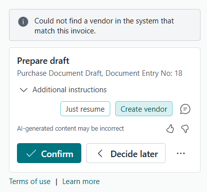
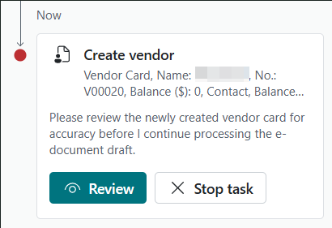
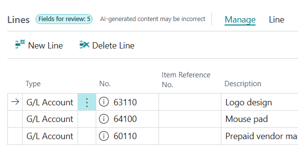
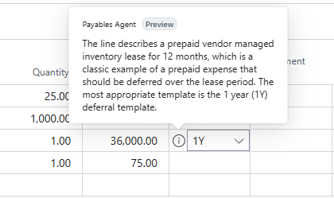

# Payables Agent overview (preview)

[!INCLUDE [preview-banner](~/../shared-content/shared/preview-includes/preview-banner.md)]

The Payables Agent solves a decade-old challenge: end-to-end processing of vendor invoices. Processing vendor invoices often creates bottlenecks and relies on accounting knowledge and mapping data and business rules to register invoices correctly.

The core goal for the Payables Agent is simple: get accounting skills and help register invoices correctly, ideally removing bottlenecks in accounts payable so finance support doesn't slow company growth. The agent needs almost no setup&mdash;just configuration and activation.

The Payables Agent monitors mailboxes for incoming vendor invoices, uses AI to analyze invoice content, and shows invoice drafts to agent supervisors for review. Ideally, users make few or no corrections before finalizing drafts, so invoices are ready for approval and posting.

[!INCLUDE [preview-note](~/../shared-content/shared/preview-includes/production-ready-preview-dynamics365.md)]
<!--[!INCLUDE [limited-public-preview](includes/limited-public-preview.md)]-->

> [!NOTE]
> [!INCLUDE[copilot-language-support-en-only](includes/copilot-language-support-en-only.md)]

## Functionality in the preview

This preview doesn't represent the full vision of the Payables Agent. The Payables Agent is in its early stages, and more features and AI capabilities are coming.

Eventually, the agent will help with:

* Purchase order matching
* Approval flows
* Anomaly detection
* Other tasks that support accounts payable processes and accounting

## Payables Agent process flow

The end-to-end process handled by the Payables Agent is shown in the following figure. The actual flow can vary depending on factors like the clarity of analyzed invoice details, existing purchase invoice history, and blocking issues.

The dashed steps in the image represent steps that&mdash;in time&mdash;are intended to be optional depending on configuration. In the public preview release, these steps aren't optional.

1. **Vendor or employee:** Vendor sends an email to a mailbox monitored by the agent. Alternatively, an employee forwards a vendor invoice to the mailbox.
1. **Payables Agent:** Picks up unread email in the monitored mailbox. It then imports the email and creates an entry in **Inbound E-Documents** for every PDF attachment, if any exists.
1. **Agent supervisor:** Reviews the email and PDF, if any was attached.
1. **Payables Agent:** Extracts invoice information from the PDF using Azure Document Intelligence.
1. **Payables Agent:** Identifies a vendor in Business Central based on the extracted invoice information.
1. **Agent supervisor:** Can assist the agent with identifying the vendor if the agent can't confidently identify the right vendor. The agent supervisor can instruct the agent to create the vendor if they prefer to let the agent prefill vendor information based on OCR extracted vendor details.
1. **Payables Agent:** The agent attempts to create the vendor and uses the available OCR extracted vendor details to fill out as many fields on the vendor card as possible.
1. **Agent Supervisor:** Is asked to review the newly created vendor, which is blocked for processing until unblocked by a relevant stakeholder.
1. **Payables Agent:** Uses AI to suggest invoice details based on the extracted invoice information.
1. **Agent supervisor:** Can review, confirm, or change the suggested invoice details in a purchase document draft, depending on agent configuration settings and the agent's confidence in the suggestions.
1. **Payables Agent:** Finalizes the purchase document draft into a purchase invoice. Users now see the invoice in the **Purchase Invoices** list.

### Email monitoring

The agent uses an internal email dispatcher running as a background task to continuously monitor a designated mailbox for incoming vendor invoices as PDF documents. The dispatcher triggers the agent to perform tasks and then imports the PDF document into **Inbound E-Documents**. 

Each PDF document found in an email becomes an entry in **Inbound E-Documents**. Thus, if there are multiple PDF attachments in the same email, an entry in **Inbound E-Documents** is created for each of them. A distinct agent task processes each entry.

> [!NOTE]
> Use a designated mailbox for receiving vendor invoices. If other agents, like the Sales Order Agent, use the same mailbox, it can cause conflicts with ownership of incoming emails.
>
> [!CAUTION]
> A fundamental principle of the Payables Agent is to import **all** emails, not just the ones that contain PDF files. Take steps to ensure that the agent has full ownership of the mailbox, process wise, and users can't accidentally read or remove emails:
> 
> - The monitored mailbox should only be attended from within Business Central
> - Users shouldn't access the monitored mailbox from Outlook.
> 
> As a consequence, emails with no PDFs show up as agent tasks and need agent overseers to decide how to handle them. PDF files that aren't recognized as invoices are marked as *unknown document type*. You can filter these documents by choosing the **Unknown Document Type** view on the **Inbound E-Documents** page and then remove them. You can also remove unsupported files received in this mailbox this way.
>
> 

### Extraction of invoice data

The PDF is sent for OCR (Optical Character Recognition) data extraction with Azure Document Intelligence, and the result is stored in the same E-Document record. 

The agent helps categorize imported PDF documents when it's uncertain if the PDF is a vendor invoice. You can identify these documents in **Inbound E-Documents** using the **Unknown Document Type**. 

### Drafting invoice details

When the agent considers a PDF document a valid vendor invoice with high confidence, it starts by identifying the vendor to create the purchase invoice draft. In this process, the agent might need help from an agent supervisor if it can't confidently identify the correct vendor. If the agent couldn't identify the vendor, the agent supervisor can instruct the agent to create the vendor on their behalf by using the **Additional instructions** field in the agent sidecar.

**The agent will stop when it cannot identify the vendor:**

**Agent supervisors can instruct the agent to go create the vendor using the OCR data as input:**

You can provide additional instructions by selecting one of the suggested actions or typing your own instructions by using the small  chat icon. After you select one of these options, select **Confirm**. In the above example, the **Create vendor** instruction is selected. 

**When the agent has created the vendor, it will ask the agent supervisor to review the newly created vendor:**

When the agent supervisor opens the vendor card, they can easily identify the fields set by the agent and fill out the rest of the fields as needed. If you want the agent to work with the current invoice right away, unblock the vendor by using the **Blocked** field on the vendor card.

> [!NOTE]
> When the agent creates a new vendor, the **Blocked** field on the vendor card is set to **All**. This behavior ensures that proper vendor approval processing can take place. Usually, vendors and their bank accounts are approved by having communication with the vendor and doing human callbacks to the vendor's finance department. In many places, this action is a requirement for a successful audit. Thus, leaving the newly created vendor in a blocked state ensures no invoicing processing can happen until the vendor is unblocked. The agent itself doesn't provide any capabilities for vendor approvals.

After you select **Confirm** in the agent sidecar, the agent tries again to identify the vendor, which should now succeed because it was just created, given that you unblocked the vendor.

After the agent identifies the vendor, it starts line-level processing of the invoice details. The agent uses different methods to draft the best possible details. For example, it might use AI, vendor invoice history, mapping text to G/L accounts, Item References, and more. The agent records all draft details for the specific vendor invoice in a **Purchase document draft** related to the **Inbound E-Document**. You can access this draft from the **Inbound E-Document** when not interacting with the agent. It's also linked in the agent **Tasks** tab of the Copilot pane when an agent supervisor is involved. 

### Finalizing the purchase document draft

The **Purchase document draft** is where the agent's draft details are shown to the user and where the agent explains why it made certain field value suggestions. The draft helps users learn about the agent's reasoning and decide whether to adjust the draft details before finalizing the draft.

**On each section you'll see hints about how many fields to review:**

**Each field where a review is required will have a tip that describes the agent's reasoning behind setting the field's value:**

These tips help you gain trust and confidence in the agent's work, and when you're done reviewing, you finalize the invoice. Finalizing a purchase draft creates a purchase invoice based on the draft. After you finalize a draft, it's linked to the purchase invoice and is no longer editable. The draft remains as long as the purchase invoice exists.

## Activation and configuration

The agent is available in Business Central and is ready for you to use. To activate it, see [Payables Agent Setup](payables-agent-setup.md) to learn how to set up the Payables Agent for the agent supervisors you want to work with the agent.

## Billing for use

The Payables Agent uses Microsoft Copilot Studio messages for AI interactions, which can incur charges based on interaction complexity. Before you use the agent, set up a billing model for your Business Central environment. Learn more in [Manage consumption-based billing](/dynamics365/business-central/dev-itpro/administration/tenant-admin-center-manage-consumption-billing).

## General agent operations

The Payables Agent runs autonomously in the background, using AI to do its tasks while keeping users informed about key steps and involving them when needed. Involvement might be needed in specific scenarios, like when users review vendor invoice drafts created by the agent, based on set preferences.

Conceptually, the agent interacts with Business Central features like a Business Central user. The agent gets general instructions in natural language that outline how to handle vendor invoices. It uses UI metadata, like captions, tooltips, and other properties, along with data on Business Central pages and its own instructions, to decide each step needed to finish the task. Starting from the designated Role Center, the agent goes through pages, selects UI actions, and enters data as a user does. This approach lets the agent stay flexible and adaptable because its interaction surface and steps aren't hardcoded. Instead, AI decides them based on the context of each step.

This flexibility lets the agent find and interact with relevant custom fields and actions. It can also try to automatically fix validation errors by processing displayed error messages and adjusting the input.

### Customer and Business Central user involvement

Agent supervisors can check the agent's steps, imported PDF invoices, and the drafted purchase invoice details. They can easily see the data the agent enters compared to data from Business Central's business logic and imported OCR data, and change the purchase invoice draft as desired.

The agent involves designated Business Central users, called agent supervisors or overseers, if it isn't sure how to register the invoice. For example, if the vendor can't be identified with confidence.

## Permissions and profiles

The agent works within the permissions and profile (role) the admin assigns. Learn more in [Manage agent permissions and user access](payables-agent-setup.md#manage-agents-permissions-to-objects-data-and-ui-elements).

## Next steps

- [Set up Payables Agent](payables-agent-setup.md)
- [Use Payables Agent](use-payables-agent.md)
- [Responsible AI FAQ for Payables Agent](faqs-payables-agent.md)

## Related information

[Configure Copilot and agent capabilities](enable-ai.md)  
