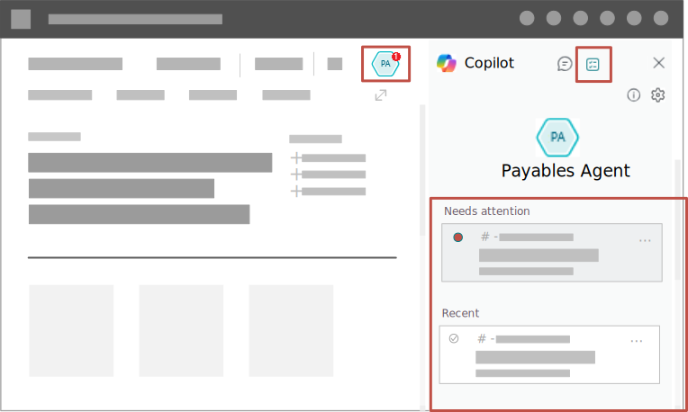
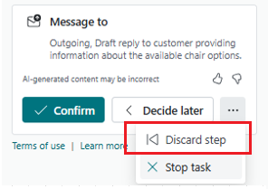

# Process vendor invoices with Payables Agent (preview)

[!INCLUDE [preview-banner](~/../shared-content/shared/preview-includes/preview-banner.md)]

This article explains how to use Payables Agent to process vendor invoices received via email. The Payables Agent uses AI to analyze incoming invoices, create drafts for review, and reduce manual corrections.

The agent monitors a designated mailbox for email from vendors or employees with attached PDF invoices. When it detects an email, it starts to create a purchase invoice and keeps you informed and involved from your role center in Business Central. Learn more in [Payables Agent overview](payables-agent.md).

[!INCLUDE [preview-note](~/../shared-content/shared/preview-includes/production-ready-preview-dynamics365.md)]
<!--[!INCLUDE [limited-public-preview](includes/limited-public-preview.md)]-->

## Supported languages

[!INCLUDE[soa-language-support](includes/soa-language-support.md)]

## Prerequisites

Payables Agent is activated, and you have permission to use it. Learn more in [Set up Payables Agent](payables-agent-setup.md).

## Get started

You collaborate with Payables Agent to process invoices using the **Tasks** tab in the **Copilot** pane. To access this tab, select  **Payable Agent** on the upper right of the navigation menu. A red circle with a number on the icon indicates the tasks that need attention.

The  **Tasks** tab opens in the **Copilot** pane to display tasks recently created by the agent. Tasks that require attention&mdash;like reviewing vendor information&mdash;are at the top of the list.  

For each invoice, the agent adds a task to track, review, and follow up on until the agent creates the purchase invoice. Each task has multiple steps that create a timeline of the process.

> [!TIP]
> Hover over the  **Payable Agent** icon in the role or select the  **Show summary for Payables Agent** in the **Task** tab to get an overview of the agent's key performance indicators (KPIs) summarizing the impact of the agent's work in your organization. For example, view the number of sales quotes or orders created by the agent, the time saved by your team, and the total number of sales orders created.

## Review and assist

The agent does most of the work autonomously, but it asks for user input when needed to move through the process. For example:

- Review and confirm the vendor information.
- Review and confirm the purchase invoice document draft.
- Help the agent get unblocked, like by providing missing data.

Learn more about the Payables Agent and its process flow in [Payables Agent process flow](payables-agent.md#payables-agent-process-flow).

Steps that need intervention appear under **Needs Attention** in the **Tasks** tab. To review a step, follow these instructions:

1. In the **Task** tab, select the step requesting review or assistance.

   The task *timeline* opens, focused on the selected step. The timeline displays each step of a task, past and present, in chronological order.

1. Select **Review** for the step.

   The **Tasks** tab switches to **Review** mode, and the review content appears in the main display area.
1. Review the contents and make changes as needed.

1. When you're satisfied with the content and want the process to continue, select **Confirm** in the **Review** pane.

   If you want to complete the task yourself, select **Stop** to halt the agent's processing of this task. Learn more in [Stop a task](#stop-a-task),

After confirmation, the agent continues with the task. When a new notification appears on the Payables Agent icon after some time, follow the same flow to review and confirm the results.

<!--
## Modify invoices

During review, you might need to modify the vendor details or purchase document draft created by the agent, or when the agent requests assistance. When you select **Review**, the invoice opens for inspection. Make changes as needed, then select **Confirm** in the **Review** pane. The agent processes the purchas invoice document.

You also have the opportunity to modify a quote or order during the review step for an outgoing email. In this case, select **...** (More options) > **Discard step** on the step. This action stops the task temporarily to allow you to open the quote or order and makes changes and then resume the step.

> [!NOTE]
> **Discard step** is available only on review steps for outgoing emails.

After you make the changes, return to the **Tasks** tab, select one of the following options for resuming the task, and then select **Send**:

- **I have updated the quote** or **I have updated the order**: Select one of these options if you made changes to the quote or order. The agent generates a new PDF and email for the customer.
- **Just resume**: Select this option if you didn't change the quote or order. The agent doesn't generate a new quote or order and keeps the original email as before.  

If you change your mind while reviewing the outgoing message and decide to make more changes to the sales document, use the **Discard step** action to discard the email message generated by the agent. Then, update the sales document as needed and instruct the agent to create a new outgoing email with the updated attachment.
-->

## Reviewing drafts from the Inbound E-Documents page

To understand how the Payables Agent drafted the purchase invoice document, you can also go directly to the **Inbound E-Documents** page and open a purchase document draft.  

Business Central helps you focus your review by highlighting the fields that benefit most from your attention, reducing the review effort and minimizing risk of inaccuracy. 

Fields that are recommended for review displays an [info] information icon. 

When you click this icon or use the **Alt+I** keyboard shortcut on the field, Business Central reveals why the Payables Agent chose that specific field value. This helps you determine whether a better value would be more appropriate. 

You can quickly replace or correct any fields that the Payables Agent didn’t quite get right. 

To complete the review and elevate the draft to a purchase invoice document, choose the **Finalize draft** action. 

Important: Fields recommended for review are provided as a convenience and you aren't required to inspect all of them. You should always review the entire purchase document draft, especially if you're new to the Payables Agent and are in the process of learning the limitations of how the agent works with your data. 

Note: while reviewing a purchase document draft, you can't use Copilot’s Autofill feature. 

## Stop a task

Most steps of a task include a **Stop** button that lets you terminate the process. When you select **Stop**, a task isn't terminated immediately&mdash;you're asked to confirm before the task is stopped.

Before you stop a task, consider the following behavior:

- Stopped tasks can't be restarted.
- Stopping the task might leave some results incomplete or unwanted, and it might require follow-up actions. Follow up actions depend on where in the process the task was stopped.
- Stopped tasks aren't deleted immediately. You can still explore a task's timeline until it's deleted, typically by an administrator.

## Related information

[Payables Agent overview](payables-agent.md)  
[Set up Payables Agent](payables-agent-setup.md)  
[FAQ for Payables Agent](faqs-payables-agent.md)  
[Configure Copilot and agent capabilities](enable-ai.md)  
